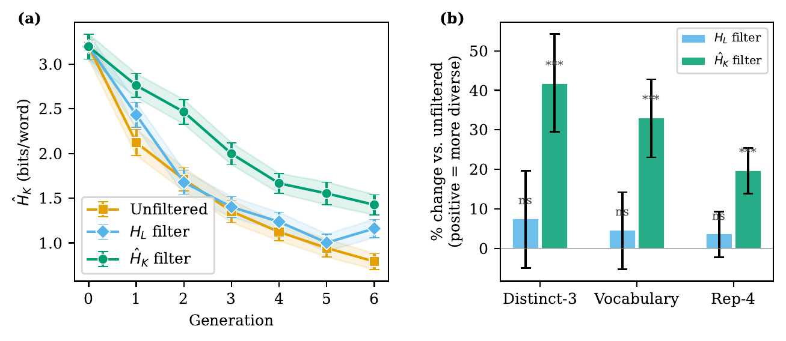

# No Model Required

**Text Entropy Rate Filtering Mitigates Iterative Fine-Tuning Collapse**

[Lewis Mitchell](mailto:lewis.mitchell@adelaide.edu.au) · Adelaide Data Science Centre, University of Adelaide
**NeurIPS 2026** · [OpenReview](https://openreview.net/forum?id=1rTomFsjg0) · [Paper PDF](https://openreview.net/pdf?id=1rTomFsjg0)

[](LICENSE)

---

Iterative fine-tuning on synthetic data causes **model collapse**: output diversity narrows as rare patterns are progressively lost, a signature most visible as phrase-level repetition. Existing mitigations either require model log-probabilities, an external oracle, or continued access to real human data.

This paper develops an alternative grounded in mathematical information theory: the non-parametric **Kontoyiannis entropy rate estimator** ($\hat H_K$) — computed entirely from raw text via match-length statistics, **with no model of any kind**. In a six-generation QLoRA collapse experiment on Llama-3.1-8B, logprob-based filtering (the most established model-access-requiring baseline) provides no significant text-diversity benefit on any metric, whereas $\hat H_K$-filtering yields **+42% unique trigrams, +30% vocabulary, and −19% repetition** — all highly significant. $\hat H_K$ is separately validated as a cross-domain entropy proxy ($\beta=0.924$, $R^2=0.746$) and a fine-tuning-collapse detector ($\rho=+0.454$, $p<0.0001$).

<p align="center">
  
</p>

<p align="center"><sub><b>(a)</b> Ĥ<sub>K</sub> across six fine-tuning generations under three training-data conditions — unfiltered collapses fastest, Ĥ<sub>K</sub>-filtered slowest. <b>(b)</b> % change vs. unfiltered at generation 6 on three text-diversity metrics: Ĥ<sub>K</sub>-filtering is highly significant on all three; logprob-based (H<sub>L</sub>) filtering is not.</sub></p>

## Key result

| Metric | Unfiltered | $H_L$-filter | $\hat H_K$-filter |
|---|---:|---:|---:|
| $\hat H_K$ (bits/word) | 0.79 | 1.16 | **1.43** |
| Distinct-3 | — | +7% (ns) | **+42%*** |
| Vocabulary | — | +4% (ns) | **+30%*** |
| Rep-4 | — | −3% (ns) | **−19%*** |

Generation-6 outcomes, $n=80$ documents/condition, $p$-values from Welch's $t$-test vs. unfiltered (`***` $p<0.001$). Reproduced live from this repo's bundled data — see [Reproducing the main result](#reproducing-the-main-result) below.

## What's in this repo

This is a **showcase and reproduction** repo, not the full research codebase — it mirrors the paper's structure and includes everything needed to reproduce the headline result and figure, without the underlying 1.6 GB of raw generated text (available separately, see below).

```
hk/                        Section 2 — the Ĥ_K estimator itself
  estimator.py                A clean, dependency-free reference implementation
                               of Equation 1, with a runnable example.

filtering_experiment/       Section 5 — the main result (Table 1, Figure 1)
  results/
    phase5_summary.json        Per-document Ĥ_K, H_L, and text-diversity metrics
                                for all 3 conditions × 7 generations × 80 docs
                                (numeric only — no document text).
    phase5_llm_judge_results.json  Coherence/instruction-following judgments used
                                to confirm Ĥ_K-filtering doesn't trade quality
                                for diversity (Section 6).
  make_figure.py              Regenerates Figure 1 and Table 1 from the bundled
                               summary above — no raw text needed.
  compute_summary.py          Regenerates phase5_summary.json itself from the
                               full raw corpus (see below), if you want to
                               verify it or recompute under a different
                               truncation length.

proxy_validation/           Section 3 — supporting data for the cross-domain
  phase1a_results.json         Ĥ_K/H_L proxy-validation result (β=0.924, R²=0.746).
                                Per-document summary only, numeric fields.

collapse_detection/          Section 4 — supporting data for the rephrasing-
  phase2a_results.json         vs-fine-tuning collapse-detection comparison
  phase3_results.json          (ρ=+0.454 under fine-tuning vs. ρ=−0.175 under
                                rephrasing). Per-document summary only.

figures/                     Pre-rendered copy of Figure 1 (PDF + PNG)
```

**Data policy.** Every JSON file here is a per-document *metadata* summary (scores, domain, generation, condition) — never the generated document text itself, so this repo doesn't reproduce the corpus, only the paper's reported numbers and figures from it. The full raw corpus (all generated documents, all conditions and generations, ~1.6 GB) is publicly available separately at [`lewismath/phase5-raw`](https://huggingface.co/datasets/lewismath/phase5-raw) on Hugging Face, if you want to recompute anything from scratch or run the estimator on the actual experiment documents yourself.

## Installation

```bash
pip install -r requirements.txt
```

The `ProcessEntropy` package ([tobinsouth/ProcessEntropy](https://github.com/tobinsouth/ProcessEntropy)) provides the finite-sample-bias-corrected, production-speed Ĥ_K implementation used to produce every reported number in the paper.

## Using the estimator

```python
from hk import hk

hk("The quick brown fox jumps over the lazy dog. " * 20)  # 0.17 bits/word — repetitive
hk(open("some_long_document.txt").read())                 # higher for varied, non-repeating text
```

(Ĥ_K returns `None` for documents shorter than ~50 words — it needs enough
text to find repeated structure in.)

See `hk/estimator.py` for the full definition (Equation 1), the tokenization scheme, and how it handles the end-of-document boundary condition.

## Reproducing the main result

```bash
cd filtering_experiment
python make_figure.py
```

This reads `results/phase5_summary.json` directly and reproduces Figure 1 and Table 1 above — no GPU, no raw corpus, no API access needed. Takes a few seconds.

To regenerate `phase5_summary.json` itself from the ground truth (rather than trust the bundled copy), download the full raw corpus from [`lewismath/phase5-raw`](https://huggingface.co/datasets/lewismath/phase5-raw) and run:

```bash
python compute_summary.py --raw-dir /path/to/phase5-raw
```

## Citation

```bibtex
@inproceedings{mitchell2026nomodel,
  title     = {No Model Required: Text Entropy Rate Filtering Mitigates Iterative Fine-Tuning Collapse},
  author    = {Mitchell, Lewis},
  booktitle = {Advances in Neural Information Processing Systems},
  year      = {2026},
  url       = {https://openreview.net/forum?id=1rTomFsjg0}
}
```

## Acknowledgments

Computational resources provided by the Phoenix HPC cluster at the University of Adelaide. The $\hat H_K$ estimator implementation builds on [`ProcessEntropy`](https://github.com/tobinsouth/ProcessEntropy) (Tobin South).

## License

MIT — see [LICENSE](LICENSE). Code and the bundled numeric result files only; the full raw corpus on Hugging Face has its own terms.
